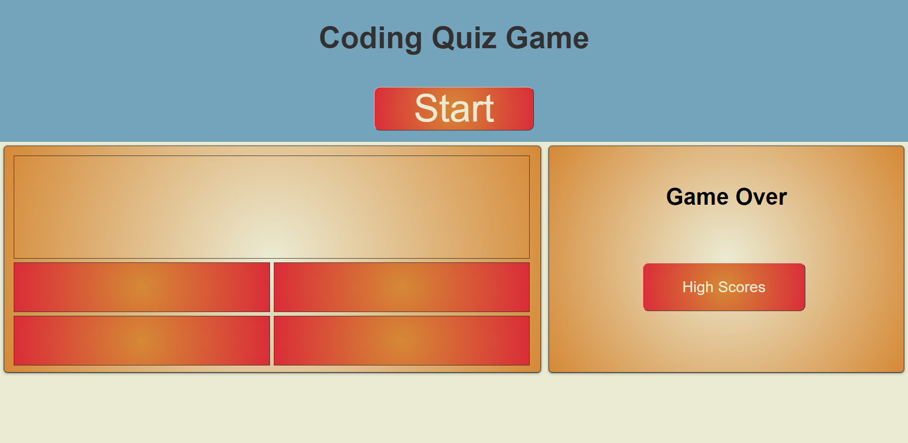

# 10 Question Coding Quiz game
10 question quiz game

## HTML / CSS / JavaScript
A simple 10 question coding quiz using vanilla JavaScript in order to process the game states, populate questions and answers, and log high scores to local storage.

## Deployed Site
[Quiz Game](https://josephlmurray.github.io/quiz-game/)

## Screen Shot

### Points of Interest
* High Score table is programatically generated

* Questions load at random

* Answers populate in a random order 
